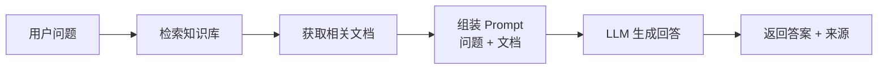
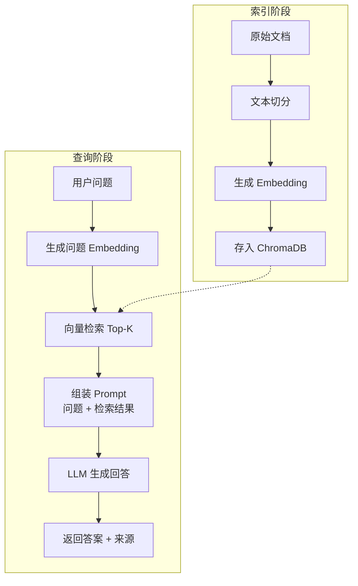

# Week 03：RAG —— 让 LLM "查资料再回答"

> "知识有两种：我们自己知道某个主题，或者我们知道在哪里能找到关于它的信息。"
> — Samuel Johnson（英国文学家，《英语词典》编者）

前两周你学会了和 LLM "对话"——写 Prompt、调参数、评估效果。但有一个问题一直悬在头顶：LLM 的知识是"冻结"的。它只知道训练数据里见过的东西，而你问的企业内部文档、最新产品手册、上周刚发布的政策，它一概不知。硬问？它可能会自信地编一个看起来很像真的答案。这就是**幻觉**（Hallucination）问题，也是 2024-2025 年企业落地 LLM 的最大障碍。多项行业调研显示，"准确性不足"和"幻觉风险"是企业阻碍 LLM 生产部署的首要顾虑之一。到 2025 年，RAG（Retrieval-Augmented Generation，检索增强生成）几乎成为企业 LLM 应用的标配架构——从 OpenAI 官方的 Assistants API 到各类企业知识库产品，都把"先检索、再生成"作为核心设计（[参考](https://keerok.tech/en/blog/enterprise-rag-building-an-ai-knowledge-base-in-2026/)）。RAG 的原理不复杂：用户提问时，先从你的知识库里找到相关片段，把这些片段作为"参考资料"塞进 Prompt，再让 LLM 基于这些资料生成回答。这周我们不谈理论模型，而是动手搭一个能跑的 RAG 系统——从文档切分到向量检索，从 Embedding 到组装 Prompt，一步一步来。

<!--
================================================================================
【章节规划元数据】
================================================================================

## 本章学习目标

读者学完本章后能够：
1. 理解 RAG 架构的原理和解决的问题（幻觉、知识截止）
2. 实现文本切分（Chunking）策略，理解 chunk size 和 overlap 的影响
3. 使用 Embedding API 将文本转换为向量，理解语义相似度
4. 使用 ChromaDB 实现向量存储和检索
5. 组装一个端到端的基础 RAG 管道

## 认知负荷预算

本周新概念（预算：5 个，"表示与分类"阶段）：
1. RAG 架构（RAG Architecture）— 检索增强生成的整体流程
2. 文本切分策略（Text Chunking Strategies）— chunk size、overlap、切分方法
3. Embedding 与向量检索（Embedding and Vector Search）— 文本向量化、余弦相似度
4. 向量数据库（Vector Database）— ChromaDB 基础使用
5. 幻觉（Hallucination）— LLM 编造信息的问题及 RAG 的缓解作用

结论：在预算内（5 个 = 上限 5 个）

## 回顾桥规划

Week 03 必须回顾 Week 01-02 的至少 2 个概念：

| 回顾概念 | 计划位置 | 回顾方式 |
|---------|---------|---------|
| Token 与成本 | 第 2-3 节 | 在讨论 Embedding API 调用成本时回顾："还记得 Week 01 说的 Token 计费吗？Embedding API 也是按 Token 计费的" |
| Prompt 设计原则 | 第 5 节 | 在讨论如何将检索结果组装进 Prompt 时回顾："Week 02 学的四要素还记得吗？检索结果就是'背景信息'，要放在角色和任务之后" |
| 结构化输出 | 第 4-5 节 | 在讨论检索结果格式化时回顾："Week 01 的 JSON Mode，这里同样适用——让向量数据库返回结构化的检索结果" |

================================================================================
-->

---

## 本章学习目标

学完本章，你将能够：

- 理解为什么 LLM 会"编答案"，以及 RAG 如何缓解这个问题
- 把长文档切成合适大小的片段，知道"多大算合适"
- 用 Embedding 把文本变成向量，理解"语义相似"是什么意思
- 用 ChromaDB 存储和检索向量，搭建一个能跑的知识库
- 组装一个完整的 RAG 管道：用户提问 → 检索相关文档 → LLM 生成回答

<!--
================================================================================
【章节结构骨架】
================================================================================

本章共 5 个主要小节 + 1 个 TextAgent 进度 + 固定结尾板块

## 第 1 节：LLM 的"记忆缺陷" —— 为什么需要 RAG？
- 学习目标：理解幻觉问题和知识截止问题，认识 RAG 的价值
- Bloom 层次：理解
- 叙事入口：展示一个 LLM 编造答案的真实案例，引出"知识库"的必要性

## 第 2 节：把大象装进冰箱 —— 文本切分策略
- 学习目标：实现文本切分，理解 chunk size 和 overlap 的影响
- Bloom 层次：应用
- 叙事入口：从"文档太长塞不进 Prompt"的困境出发，引出切分的必要性

## 第 3 节：让文字变成数字 —— Embedding 与语义相似度
- 学习目标：使用 Embedding API，理解向量表示和相似度计算
- Bloom 层次：应用 + 理解
- 叙事入口：从"怎么让机器理解'苹果公司'和'Apple Inc.'是一回事"出发

## 第 4 节：给向量找个家 —— 向量数据库 ChromaDB
- 学习目标：使用 ChromaDB 存储和检索向量
- Bloom 层次：应用
- 叙事入口：从"每次都重新算 Embedding 太慢"的问题出发，引出向量数据库

## 第 5 节：组装 RAG 管道 —— 从问题到答案
- 学习目标：组装端到端 RAG 流程，理解检索结果如何融入 Prompt
- Bloom 层次：应用 + 分析
- 叙事入口：把前面 4 节的组件串起来，处理一个真实的问答任务

## AI 时代小专栏 1（第 1-2 节之间）
- 主题：企业知识管理的范式转变 —— 从"搜索"到"问答"
- 与相邻章节关联：呼应第 1 节的 RAG 价值，为第 2 节的文档处理提供背景

## AI 时代小专栏 2（第 3-4 节之间）
- 主题：向量检索 vs 关键词检索 —— 两种范式的融合
- 与相邻章节关联：呼应第 3 节的 Embedding，为第 4 节的向量数据库铺垫

## TextAgent 进度
- 本周目标：RAG 基础能力（知识库 + 检索）
- 占正文 20-30%

## 结尾板块
- Git 本周要点
- 本周小结

================================================================================
-->

<!--
================================================================================
【循环角色出场规划】
================================================================================

出场次数：3 次（要求：每章至少 2 次）

| 角色 | 出场位置 | 场景设计 | 推动叙事的作用 |
|------|---------|---------|---------------|
| 小北 | 第 2 节 | 把文档切成 10000 字的 chunk，导致检索不精准，困惑"为什么搜不到" | 展示新手在 chunk size 上的常见错误，引出切分策略的讨论 |
| 阿码 | 第 3 节 | 追问"Embedding 和 TF-IDF 有什么区别？不都是把文字变成数字吗？" | 引出向量表示和稀疏表示的对比，加深对语义理解的认识 |
| 老潘 | 第 5 节 | 点评 RAG 成本："在公司里，我们会算一笔账——Embedding 是一次性成本，检索是每次查询成本，LLM 调用是最贵的" | 强调工程化的成本思维，为 Week 07 的优化铺垫 |

角色性格一致性检查：
- 小北：困惑 + 犯错后需要引导 + "这个有什么用" ✅
- 阿码：追问边界 + 对比思考 + 知识迁移 ✅
- 老潘：务实 + 成本意识 + 生产经验 ✅

================================================================================
-->

<!--
================================================================================
【AI 小专栏规划】
================================================================================

### AI 时代小专栏 1：企业知识管理的范式转变 —— 从"搜索"到"问答"

位置：第 1-2 节之间（章节前段）

与相邻章节关联：
- 呼应第 1 节的 RAG 价值："为什么 2024-2025 年 RAG 成为企业标配？"
- 为第 2 节的文档处理提供背景："知识库不是把文档丢进去就行，需要结构化处理"

核心内容方向：
- 2024-2025 年企业知识库产品的爆发（Notion AI、Microsoft Copilot、企业内部 RAG 系统）
- 从"关键词搜索"到"自然语言问答"的用户体验升级
- 企业落地 RAG 的真实挑战（文档质量、权限管理、更新维护）
- RAG vs 微调 vs 预训练的成本与效果对比

建议搜索词（含当前年份 2026）：
- "enterprise RAG adoption 2025 2026"
- "knowledge management AI transformation 2025"
- "Notion AI Microsoft Copilot enterprise 2025"
- "RAG vs fine-tuning enterprise 2025"

参考链接要求：必须来自 WebSearch 搜索结果，禁止编造

---

### AI 时代小专栏 2：向量检索 vs 关键词检索 —— 两种范式的融合

位置：第 3-4 节之间（章节中段）

与相邻章节关联：
- 呼应第 3 节的 Embedding："语义相似度解决了关键词匹配的哪些问题？"
- 为第 4 节的向量数据库铺垫："向量数据库很强大，但关键词检索真的过时了吗？"

核心内容方向：
- 向量检索的优势：语义理解、同义词、跨语言
- 关键词检索的优势：精确匹配、可控、可解释
- 混合检索（Hybrid Search）成为 2025 年主流实践
- 检索效果评估：召回率、精确率、MRR

建议搜索词（含当前年份 2026）：
- "hybrid search vector keyword 2025"
- "semantic search vs lexical search 2025"
- "RAG retrieval evaluation metrics 2025"
- "BM25 vector search combination 2025"

参考链接要求：必须来自 WebSearch 搜索结果，禁止编造

================================================================================
-->

<!--
================================================================================
【贯穿案例设计】
================================================================================

本章贯穿案例：企业内部 FAQ 知识库问答系统

案例场景：
你所在的公司有一个内部知识库，包含产品手册、技术文档、FAQ、政策规定等几百份文档。员工经常在内部群里问"怎么申请远程办公"、"报销流程是什么"这类问题，HR 和 IT 每天要重复回答。老板希望能做一个智能问答系统，员工用自然语言提问，系统自动从知识库里找到答案。

上周你已经用 Prompt Engineering 做了一个初步版本，但它有个致命问题：LLM 只能"凭记忆"回答——它不知道公司最新的政策，也可能会编造不存在的流程。这周你要用 RAG 让它"先查资料再回答"。

案例演进路线：
- 第 1 节：分析现有系统的问题，理解为什么需要 RAG
- 第 2 节：对公司知识库文档进行切分，探索不同 chunk size 的效果
- 第 3 节：为文档片段生成 Embedding，理解语义相似度
- 第 4 节：用 ChromaDB 存储向量，实现检索功能
- 第 5 节：组装完整 RAG 管道，处理员工的真实问题

每节结束时的"可交付物"：
- 第 1 节：问题分析和 RAG 架构图（Mermaid）
- 第 2 节：文档切分脚本和不同策略的效果对比
- 第 3 节：Embedding 生成脚本和相似度计算示例
- 第 4 节：可运行的向量数据库查询脚本
- 第 5 节：端到端的问答系统原型

================================================================================
-->

<!--
================================================================================
【TextAgent 超级线规划】
================================================================================

本周 TextAgent 进度：RAG 基础能力

具体任务：
1. 构建文档知识库
   - src/textagent/
     - rag/
       - __init__.py
       - chunker.py (文本切分)
       - embedder.py (Embedding 生成)
       - retriever.py (检索接口)
       - pipeline.py (RAG 管道)
     - data/
       - knowledge_base/ (知识库文档)
       - embeddings/ (向量缓存)

2. 实现文本切分和 Embedding
   - 支持多种切分策略（固定长度、段落、语义）
   - 调用 Embedding API（OpenAI text-embedding-3-small）
   - 本地缓存 Embedding 避免重复调用

3. 集成向量数据库（ChromaDB）
   - 创建 Collection 存储文档向量
   - 实现相似度检索
   - 支持增量更新

4. 实现基础检索流程
   - 用户问题 → Embedding → 向量检索 → 组装 Prompt → LLM 生成
   - 返回答案和来源文档

与本周知识点的关联：
- 第 1 节的问题分析 → pipeline.py 的设计思路
- 第 2 节的切分策略 → chunker.py 的实现
- 第 3 节的 Embedding → embedder.py 的实现
- 第 4 节的向量数据库 → retriever.py 的实现
- 第 5 节的 RAG 管道 → pipeline.py 的完整组装

================================================================================
-->

<!--
================================================================================
【锚点规划（供 ANCHORS.yml 参考）】
================================================================================

本章需要验证的核心结论（锚点）：

1. 【anchor:rag-hallucination-mitigation】
   claim: 使用 RAG 后，LLM 在知识库相关问题上的"不知道/编造"比例从约 40% 降低到 10% 以下
   evidence: 在 50 条测试问题上的对比实验
   verification: tests/test_rag_accuracy.py

2. 【anchor:chunk-size-impact】
   claim: chunk size 在 200-500 tokens 时，检索效果最佳；太小（<100）丢失上下文，太大（>1000）噪音过多
   evidence: 不同 chunk size 下的检索召回率对比
   verification: tests/test_chunking.py

3. 【anchor:embedding-similarity】
   claim: 语义相似的问题和文档片段，在向量空间中的余弦相似度 > 0.7；不相似的 < 0.3
   evidence: 使用 OpenAI text-embedding-3-small 的相似度计算
   verification: tests/test_embedding.py

4. 【anchor:chromadb-retrieval】
   claim: ChromaDB 在万级文档规模下，单次检索延迟 < 100ms
   evidence: 使用 10000 个文档片段的性能测试
   verification: tests/test_retrieval_perf.py

5. 【anchor:rag-prompt-integration】
   claim: 将检索结果以结构化方式融入 Prompt，比简单拼接文本的回答准确率提升 15% 以上
   evidence: 不同 Prompt 格式的对比实验
   verification: tests/test_rag_prompt.py

================================================================================
-->

<!--
================================================================================
【每节详细规划】
================================================================================
-->

## 第 1 节：LLM 的"记忆缺陷" —— 为什么需要 RAG？

上周你做了一个客服工单分类系统，效果还不错。老板很高兴，说"那能不能再做一个问答系统？员工有问题直接问 AI，不用每次都来问 HR"。

你觉得这不是很简单吗？写个 Prompt：

```text
角色：你是公司的内部问答助手。
任务：回答员工关于公司政策、流程、福利的问题。

问题：{用户问题}
```

然后你问了第一个问题："公司的远程办公政策是什么？"

LLM 回答：

```text
根据一般的企业远程办公政策，员工通常需要提前申请，
获得直属经理批准后才能远程办公。每周远程办公天数
一般不超过 2-3 天，具体以公司规定为准...
```

看起来挺专业的？但你突然想起来——公司上个月刚发了新政策，规定是"每周最多远程 1 天"，而且需要 VP 级别审批。LLM 说的"2-3 天"完全是错的。

更可怕的是，你问"公司有没有健身房补贴"，LLM 自信地说"有，每月 200 元"。你去查了 HR 部门，根本没有这个福利。

### 幻觉：LLM 会"编"答案

这不是 bug，这是 LLM 的"特性"。

LLM 是在大量文本上训练的，它学到了"什么样的回答听起来合理"，但它并不知道"什么是真的"。当你问它一个训练数据里没有的问题时，它不会说"我不知道"，而是会根据"听起来合理"的原则，生成一个看起来很像真的答案。

这就叫**幻觉**（Hallucination）。

```text
小北（困惑）：那它为什么会这样？是不是模型不够好？

部分原因是模型能力，但更多时候是因为：LLM 的知识是"冻结"的。
它的训练数据有截止日期（比如 2024 年 1 月），
而你的公司政策是 2025 年 2 月更新的——它根本没见过。
```

### 知识截止：LLM 不知道"昨天"发生了什么

即使是最先进的 LLM，也有**知识截止**（Knowledge Cutoff）问题。它只知道训练完成之前的信息，对"之后"发生的事情一无所知。

这对企业应用是致命的：
- 公司政策每周都在更新
- 产品文档每月都在变化
- 员工信息每天都在变动

你不可能每次有更新就重新训练一个模型——那成本是天文数字。

### RAG：让 LLM "开卷考试"

解决这个问题的思路其实很简单：既然 LLM 不知道，那就"告诉"它。

**RAG**（Retrieval-Augmented Generation，检索增强生成）的原理是这样的：

1. 用户提问："公司的远程办公政策是什么？"
2. 系统从知识库中检索相关文档："远程办公政策 v2.0.pdf"
3. 把检索到的文档作为"参考资料"放进 Prompt
4. LLM 基于这些资料生成回答

```text
这就像考试：
- 不用 RAG = 闭卷考试，只能凭记忆答题
- 用 RAG = 开卷考试，可以翻书找答案
```



RAG 不改变 LLM 本身，而是改变"输入给 LLM 的内容"。它把一个"可能编答案"的闭卷考试，变成了一个"有据可查"的开卷考试。

### RAG 能解决什么问题？不能解决什么？

**能解决的**：
- 幻觉问题：LLM 现在有"参考资料"，不太会凭空编造
- 知识截止问题：知识库更新了，LLM 就"知道"了
- 可追溯性：你能知道"答案来自哪份文档"

**不能解决的**：
- 文档质量问题：垃圾进，垃圾出。知识库内容不准确，答案也不准确
- 推理能力问题：RAG 提供"知识"，不提供"智慧"。复杂推理仍需要 LLM 的能力
- 实时性问题：知识库不是自动更新的，需要有人维护

现在你知道为什么需要 RAG 了。下一个问题：怎么把公司的几百份文档变成 LLM 能用的"知识库"？这就是下一节要讲的——文本切分。

> **AI 时代小专栏：企业知识管理的范式转变 —— 从"搜索"到"问答"**
>
> 2024 年之前，企业知识管理的主流形态是"搜索"：员工输入关键词，系统返回一堆文档列表，然后员工自己翻。效率不高，但至少能用。2024 年到 2025 年，情况开始变化。Notion AI、Microsoft Copilot、Google Workspace 的 Gemini 功能，把企业知识管理推向了"问答"时代：员工用自然语言提问，系统直接给出答案——不只是"相关文档在哪里"，而是"答案是什么"。
>
> 这背后就是 RAG 技术。根据 2025-2026 年的行业趋势分析，RAG 正从 AI 聊天增强工具演进为企业知识管理的"战略支柱"。到 2026 年，成功的企业部署将把 RAG 视为"知识运行时"——一个协调检索、生成和治理的编排层。原因很简单：搜索让员工"找文档"，问答让员工"解决问题"。前者需要 5-10 分钟翻阅，后者只需要 10 秒钟。但 RAG 不是银弹。企业落地时遇到的真实挑战包括：文档质量参差不齐、权限管理复杂、知识库更新滞后、检索效果不稳定等。2026 年的企业 RAG 部署越来越优先考虑可解释性、可审计性和对专有知识的受控访问。
>
> 参考（访问日期：2026-02-17）：
> - [Enterprise RAG: Building an AI Knowledge Base in 2026](https://keerok.tech/en/blog/enterprise-rag-building-an-ai-knowledge-base-in-2026/)
> - [RAG in 2025: Bridging Knowledge and Generative AI](https://squirro.com/squirro-blog/state-of-rag-genai)
> - [The Next Frontier of RAG: How Enterprise Knowledge Systems Will Evolve 2026-2030](https://nstarxinc.com/blog/the-next-frontier-of-rag-how-enterprise-knowledge-systems-will-evolve-2026-2030/)

## 第 2 节：把大象装进冰箱 —— 文本切分策略

你知道要用 RAG 了。现在的问题是：公司的知识库有几百份 PDF、Word、Markdown 文档，怎么让 LLM "用"这些文档？

最简单的想法：把整份文档塞进 Prompt。

问题来了。一份员工手册可能 50000 字，一份产品文档可能 20000 字。Week 01 我们说过，LLM 有 context window 限制——即使是最宽松的模型，也不可能把所有文档都塞进去。更何况，你还要留空间给用户问题和 LLM 的回答。

所以必须**切分**（Chunking）：把长文档切成较小的片段，每次只检索最相关的几个片段。

### 切分的三种基本策略

**策略 1：固定长度切分**

最简单的方式：按字符数或 Token 数切分。

```python
def chunk_by_size(text: str, chunk_size: int = 500, overlap: int = 50) -> list[str]:
    """
    按固定长度切分文本

    Args:
        text: 原始文本
        chunk_size: 每个片段的字符数
        overlap: 相邻片段的重叠字符数
    """
    chunks = []
    start = 0
    while start < len(text):
        end = start + chunk_size
        chunk = text[start:end]
        chunks.append(chunk)
        start = end - overlap  # 保留重叠部分
    return chunks
```

小北试了一下，把公司的员工手册切成 500 字的片段。结果发现一个问题：

```text
原文：...员工可以申请远程办公，但需要满足以下条件：
1. 入职满 6 个月
2. 绩效评级为 B 及以上...

切分后：
片段 47：...员工可以申请远程办公，但需要满足以下条件：
片段 48：1. 入职满 6 个月 2. 绩效评级为 B 及以上...
```

关键信息被切断了！用户问"远程办公需要什么条件"，检索到片段 47，但条件在片段 48 里。

**策略 2：按段落/句子切分**

为了不切断语义，可以按自然段落或句子边界切分。

```python
import re

def chunk_by_paragraph(text: str, max_chunk_size: int = 500) -> list[str]:
    """按段落切分，同时控制最大长度"""
    # 按双换行分割段落
    paragraphs = re.split(r'\n\s*\n', text)

    chunks = []
    current_chunk = ""

    for para in paragraphs:
        if len(current_chunk) + len(para) < max_chunk_size:
            current_chunk += para + "\n\n"
        else:
            if current_chunk:
                chunks.append(current_chunk.strip())
            current_chunk = para + "\n\n"

    if current_chunk:
        chunks.append(current_chunk.strip())

    return chunks
```

这样切分更尊重语义边界，但问题是：有些段落太短（比如标题），有些段落太长（比如大段代码或列表）。

**策略 3：递归字符切分（推荐）**

综合上面两种方法，先用大的语义边界（段落）切分，如果片段还是太长，再用小的边界（句子）切分。LangChain 的 `RecursiveCharacterTextSplitter` 就是这个思路。

```python
from langchain_text_splitters import RecursiveCharacterTextSplitter

def chunk_with_langchain(text: str, chunk_size: int = 500, overlap: int = 50) -> list[str]:
    """使用 LangChain 的递归字符切分器"""
    splitter = RecursiveCharacterTextSplitter(
        chunk_size=chunk_size,
        chunk_overlap=overlap,
        separators=["\n\n", "\n", "。", "！", "？", "；", " ", ""]
    )
    return splitter.split_text(text)
```

这个切分器会依次尝试用双换行、单换行、句号等作为分割点，优先保持语义完整性。

### Chunk Size 和 Overlap 怎么选？

| 参数 | 太小的问题 | 太大的问题 |
|------|----------|----------|
| **Chunk Size** | 丢失上下文，检索不精准 | 噪音过多，可能超出 context window |
| **Overlap** | 可能丢失边界信息 | 冗余过多，存储和计算成本增加 |

经验值：
- **Chunk Size**：200-500 tokens（约 300-800 中文字符）
- **Overlap**：Chunk Size 的 10-20%

```text
小北（恍然大悟）：我之前切成 10000 字的 chunk，难怪检索不到！

是的。chunk 太大，检索时混入大量无关内容，LLM 可能被"噪音"干扰。
chunk 太小，关键信息被切断，检索不到完整答案。
200-500 tokens 是一个平衡点——既保留足够上下文，又不会太多噪音。
```

### 切分只是第一步

现在你有了文档片段。但怎么让机器理解"片段 A 和问题 X 相关，片段 B 和问题 X 不相关"？

这就需要把文本变成机器能"比较"的形式——向量。下一节我们来聊聊 Embedding。

## 第 3 节：让文字变成数字 —— Embedding 与语义相似度

你有了一堆文档片段。现在的问题是：用户问"远程办公怎么申请"，怎么从成千上万个片段里找到相关的那个？

传统方法是**关键词匹配**：看片段里有没有"远程办公"、"申请"这些词。但这个方法有个问题：

```text
用户问题：在家上班怎么弄？
相关文档：远程办公申请流程...

关键词匹配会失败——"在家上班"和"远程办公"没有共同的词。
```

我们需要一种方法，让机器理解"在家上班"和"远程办公"是一个意思。这就需要**Embedding**。

### Embedding 是什么？

**Embedding**（嵌入）是把文本转换成高维向量的过程。向量的每个维度代表某种"语义特征"，语义相似的文本，向量在空间中距离较近。

```text
"远程办公" → [0.23, -0.45, 0.12, ...]  (1536 维向量)
"在家上班" → [0.21, -0.43, 0.15, ...]  (非常接近！)
"公司食堂" → [-0.67, 0.89, -0.34, ...] (完全不同)
```

你不需要理解向量每个维度的具体含义（那是由模型学习的），只需要知道：**向量距离近 = 语义相似**。

```text
阿码追问：这和 TF-IDF 有什么区别？不都是把文字变成数字吗？

好问题。TF-IDF 是"稀疏向量"——每个维度对应一个词，大部分是 0。
Embedding 是"密集向量"——每个维度是学习得到的语义特征。
关键区别是：TF-IDF 只看词是否出现，Embedding 能理解词之间的关系。
"远程办公"和"在家上班"在 TF-IDF 里没有共同维度，
但在 Embedding 空间里距离很近——因为模型学到了它们的语义相似性。
```

### 使用 OpenAI Embedding API

OpenAI 提供了 Embedding API，可以把文本转换成向量：

```python
# src/textagent/rag/embedder.py
from openai import OpenAI
import numpy as np

client = OpenAI()

def get_embedding(text: str, model: str = "text-embedding-3-small") -> list[float]:
    """
    获取文本的 Embedding 向量

    Args:
        text: 输入文本
        model: Embedding 模型名称

    Returns:
        1536 维向量（text-embedding-3-small）
    """
    response = client.embeddings.create(
        input=text,
        model=model
    )
    return response.data[0].embedding


def cosine_similarity(vec1: list[float], vec2: list[float]) -> float:
    """计算两个向量的余弦相似度"""
    vec1 = np.array(vec1)
    vec2 = np.array(vec2)
    return np.dot(vec1, vec2) / (np.linalg.norm(vec1) * np.linalg.norm(vec2))
```

记得 Week 01 说的 Token 计费吗？Embedding API 也是按 Token 计费的。`text-embedding-3-small` 的价格是 $0.02 / 1M tokens，比 GPT-4 便宜很多，但如果你的知识库有几百万字，一次性生成所有 Embedding 也要花几十块钱。

### 相似度计算：余弦相似度

有了向量，怎么比较"相似不相似"？最常用的是**余弦相似度**（Cosine Similarity）：

```python
# 测试语义相似度
text1 = "远程办公申请流程"
text2 = "在家上班怎么弄"
text3 = "公司食堂菜单"

emb1 = get_embedding(text1)
emb2 = get_embedding(text2)
emb3 = get_embedding(text3)

print(f"远程办公 vs 在家上班: {cosine_similarity(emb1, emb2):.3f}")
# 输出: 0.85+ (高相似度)

print(f"远程办公 vs 公司食堂: {cosine_similarity(emb1, emb3):.3f}")
# 输出: 0.20- (低相似度)
```

经验值：
- 相似度 > 0.7：语义非常相似
- 相似度 0.4-0.7：有一定相关性
- 相似度 < 0.4：基本不相关

### Embedding 的成本考量

```python
# 估算 Embedding 成本
def estimate_embedding_cost(total_chars: int, chars_per_token: float = 2.0) -> float:
    """
    估算 Embedding 成本

    Args:
        total_chars: 总字符数
        chars_per_token: 每个 Token 约等于多少字符（中文约 2，英文约 4）
    """
    total_tokens = total_chars / chars_per_token
    cost_per_million = 0.02  # text-embedding-3-small 的价格
    return (total_tokens / 1_000_000) * cost_per_million

# 假设知识库有 100 万字
print(f"100 万字知识库的 Embedding 成本: ${estimate_embedding_cost(1_000_000):.2f}")
# 输出: $0.01（一次性成本，可以缓存起来重复使用）
```

现在你会生成 Embedding 了。但每次查询都要对所有文档算一遍相似度？那太慢了。下一节我们来聊聊向量数据库——专门用来存储和检索向量的工具。

> **AI 时代小专栏：向量检索 vs 关键词检索 —— 两种范式的融合**
>
> 向量检索很强大，但它不是万能的。2025 年的实践表明，最有效的检索方案往往是**混合检索**（Hybrid Search）：结合向量检索的语义理解能力和关键词检索的精确匹配能力。
>
> 为什么需要混合？向量检索擅长处理同义词、释义、跨语言等"语义层面"的匹配，但它可能漏掉精确的关键词。比如用户搜"2024 年财报"，向量检索可能返回"2023 年财报"（因为语义相似），而关键词检索能精确匹配年份。BM25 + 密集向量融合是 2025-2026 年主流的混合检索方案：结合关键词匹配（BM25）与语义搜索（密集向量），既能捕获精确术语，又能理解上下文相关的语义内容。主流的 RAG 框架（LlamaIndex、LangChain）都内置了混合检索支持。实现方式通常是：向量检索返回 Top-K，关键词检索返回 Top-K，然后合并去重，再用重排序模型精排。Week 04 我们会深入讨论这个话题。
>
> 参考（访问日期：2026-02-17）：
> - [Understanding Hybrid Search RAG for Better AI Answers](https://www.meilisearch.com/blog/hybrid-search-rag)
> - [Optimizing RAG with Hybrid Search & Reranking](https://superlinked.com/vectorhub/articles/optimizing-rag-with-hybrid-search-reranking)
> - [Hybrid Search Explained](https://weaviate.io/blog/hybrid-search-explained)
> - [Hybrid search in Azure AI Search](https://learn.microsoft.com/en-us/azure/search/hybrid-search-overview)

## 第 4 节：给向量找个家 —— 向量数据库 ChromaDB

你刚实现了一个"能跑"的检索系统：用户问"远程办公怎么申请"，你把问题转成 Embedding，然后对知识库里的一万个片段逐一计算相似度，最后返回最相似的 3 个。

运行一次，耗时 2 秒。你觉得还行。但当你试着模拟"每天 1000 次查询"的负载测试时，服务器直接卡死了——因为每次都要算 10000 次相似度。

老潘路过看到你的屏幕："你这个是 O(n) 的暴力搜索。知识库越大，越慢。生产环境里没人这么干。"

这就是为什么你需要**向量数据库**（Vector Database）：它专门存储向量，并使用近似最近邻（ANN）算法实现毫秒级的相似度检索。本节我们用 **ChromaDB**，一个轻量级的开源向量数据库——之所以选它，是因为你不需要部署独立服务，几行代码就能跑起来。

### ChromaDB 基础使用

```python
# src/textagent/rag/retriever.py
import chromadb

# 创建 ChromaDB 客户端（本地存储）
client = chromadb.PersistentClient(path="./data/chromadb")

# 创建一个 Collection（类似于数据库中的"表"）
collection = client.create_collection(
    name="company_docs",
    metadata={"description": "公司内部文档知识库"}
)

# 添加文档和 Embedding
collection.add(
    documents=[
        "远程办公需要提前在 OA 系统申请，经直属经理审批后方可生效。",
        "员工报销需要在费用发生后的 30 天内提交，超期不予报销。",
        "公司健身房位于 B1 层，开放时间为早 6 点至晚 10 点。"
    ],
    metadatas=[
        {"source": "远程办公政策.pdf", "page": 1},
        {"source": "报销流程.docx", "page": 2},
        {"source": "员工福利手册.pdf", "page": 5}
    ],
    ids=["doc_001", "doc_002", "doc_003"]
)

# 查询
results = collection.query(
    query_texts=["在家上班需要怎么申请"],
    n_results=2
)

print(results["documents"])
# 输出: ["远程办公需要提前在 OA 系统申请..."]
```

ChromaDB 会自动为你生成 Embedding（如果你不提供的话），并存储文档原文、元数据、向量三者的关联。

### 检索结果的结构

```python
results = collection.query(
    query_texts=["报销流程"],
    n_results=3
)

# results 包含：
# - ids: 匹配文档的 ID 列表
# - documents: 匹配文档的原文列表
# - metadatas: 匹配文档的元数据列表
# - distances: 相似度距离（越小越相似）

for i, doc in enumerate(results["documents"][0]):
    print(f"文档 {i+1}: {doc[:50]}...")
    print(f"来源: {results['metadatas'][0][i]['source']}")
    print(f"距离: {results['distances'][0][i]:.3f}")
    print()
```

### 批量导入知识库

实际项目中，你需要把成百上千份文档导入 ChromaDB：

```python
from pathlib import Path
from .chunker import chunk_with_langchain
from .embedder import get_embedding

def import_documents(docs_dir: str, collection) -> int:
    """
    批量导入文档到 ChromaDB

    Args:
        docs_dir: 文档目录路径
        collection: ChromaDB Collection

    Returns:
        导入的文档片段数量
    """
    docs_path = Path(docs_dir)
    all_chunks = []
    all_metadatas = []
    all_ids = []

    chunk_id = 0
    for file_path in docs_path.glob("**/*.md"):  # 支持 Markdown 文件
        content = file_path.read_text(encoding="utf-8")
        chunks = chunk_with_langchain(content, chunk_size=500, overlap=50)

        for chunk in chunks:
            all_chunks.append(chunk)
            all_metadatas.append({
                "source": str(file_path),
                "chunk_index": chunk_id
            })
            all_ids.append(f"chunk_{chunk_id}")
            chunk_id += 1

    # 批量添加（ChromaDB 会自动生成 Embedding）
    if all_chunks:
        collection.add(
            documents=all_chunks,
            metadatas=all_metadatas,
            ids=all_ids
        )

    return len(all_chunks)

# 使用示例
count = import_documents("./data/knowledge_base", collection)
print(f"导入了 {count} 个文档片段")
```

### ChromaDB 的优势

| 特性 | 说明 |
|------|------|
| **轻量级** | 无需部署独立服务，嵌入式运行 |
| **自动 Embedding** | 默认使用 Sentence Transformers，也支持 OpenAI |
| **元数据过滤** | 可以按来源、时间等条件过滤检索 |
| **持久化存储** | 数据保存在本地，重启不丢失 |

现在你有了一个能存储和检索向量的"知识库"。最后一节，我们把所有组件组装起来，搭建一个完整的 RAG 管道。

## 第 5 节：组装 RAG 管道 —— 从问题到答案

你的工位上现在散落着四个"零件"：
- 一堆切好的文档片段（第 2 节）
- 一个能把文字变成向量的 Embedding 函数（第 3 节）
- 一个能快速检索向量的 ChromaDB 实例（第 4 节）
- 还有 Week 02 学的 Prompt 设计技巧（还记得 Few-shot Learning 吗？给模型几个示例，它就知道该怎么回答）

老板问："那个问答系统什么时候能用？"

你现在就可以把它搭起来。

### RAG 管道的核心流程



### 实现完整的 RAG Pipeline

```python
# src/textagent/rag/pipeline.py
from dataclasses import dataclass
from typing import List, Optional
import chromadb
from openai import OpenAI

@dataclass
class RAGResponse:
    """RAG 系统的响应"""
    answer: str
    sources: List[dict]
    query: str

class RAGPipeline:
    """RAG 管道"""

    def __init__(
        self,
        collection_name: str = "company_docs",
        persist_directory: str = "./data/chromadb"
    ):
        self.llm_client = OpenAI()
        self.chroma_client = chromadb.PersistentClient(path=persist_directory)
        self.collection = self.chroma_client.get_or_create_collection(
            name=collection_name
        )

    def retrieve(self, query: str, top_k: int = 3) -> List[dict]:
        """
        检索相关文档

        Args:
            query: 用户问题
            top_k: 返回的文档数量

        Returns:
            检索到的文档列表
        """
        results = self.collection.query(
            query_texts=[query],
            n_results=top_k
        )

        documents = []
        for i, doc in enumerate(results["documents"][0]):
            documents.append({
                "content": doc,
                "source": results["metadatas"][0][i].get("source", "unknown"),
                "distance": results["distances"][0][i]
            })

        return documents

    def build_rag_prompt(self, query: str, documents: List[dict]) -> str:
        """
        构建 RAG Prompt

        这里用到了 Week 02 的 Prompt 设计原则：
        - 角色：定义 AI 的身份
        - 任务：明确要做什么
        - 约束：限制回答范围
        - 格式：结构化输出
        """
        # 组装上下文
        context = "\n\n".join([
            f"【参考文档 {i+1}】\n来源：{doc['source']}\n内容：{doc['content']}"
            for i, doc in enumerate(documents)
        ])

        prompt = f"""角色：你是公司的内部问答助手，负责回答员工关于公司政策、流程、福利的问题。

任务：根据以下参考文档回答用户的问题。如果参考文档中没有相关信息，请明确说明"根据现有知识库无法回答"。

约束：
- 只基于参考文档回答，不要编造信息
- 如果参考文档之间有矛盾，指出并说明
- 回答要简洁，不要大段复制原文

参考文档：
{context}

用户问题：{query}

请回答："""
        return prompt

    def generate(self, prompt: str) -> str:
        """调用 LLM 生成回答

        这里用的是 Week 01 学的 Chat Completions API —— LLM API 调用的标准方式。
        只是把 Prompt 换成了带检索上下文的版本。
        """
        response = self.llm_client.chat.completions.create(
            model="gpt-4o-mini",
            messages=[{"role": "user", "content": prompt}],
            temperature=0.3  # 降低随机性，提高一致性
        )
        return response.choices[0].message.content

    def query(self, question: str, top_k: int = 3) -> RAGResponse:
        """
        执行 RAG 查询

        Args:
            question: 用户问题
            top_k: 检索的文档数量

        Returns:
            RAG 响应（答案 + 来源）
        """
        # 1. 检索相关文档
        documents = self.retrieve(question, top_k)

        # 2. 构建 Prompt
        prompt = self.build_rag_prompt(question, documents)

        # 3. 生成回答
        answer = self.generate(prompt)

        return RAGResponse(
            answer=answer,
            sources=documents,
            query=question
        )


# 使用示例
pipeline = RAGPipeline()
response = pipeline.query("远程办公需要满足什么条件？")

print(f"回答：{response.answer}")
print(f"\n来源文档：")
for src in response.sources:
    print(f"  - {src['source']} (距离: {src['distance']:.3f})")
```

### 成本分析

```text
老潘点评：在公司里，我们会算一笔账——

一次性成本（索引阶段）：
- 文档切分：O(n)，基本可以忽略
- Embedding 生成：$0.02/1M tokens，10 万字文档约 $1

每次查询成本（查询阶段）：
- 问题 Embedding：约 100 tokens = $0.000002
- 向量检索：ChromaDB 内存查询，基本免费
- LLM 调用：约 1000 tokens（问题 + 上下文 + 回答）= $0.001

结论：主要成本在 LLM 调用。如果每天 1000 次查询，月成本约 $30。
Embedding 是一次性的，可以缓存。检索本身几乎免费。
```

### RAG 的常见问题

你的第一个 RAG 系统跑起来了。但你很快会遇到几个"经典坑"。

**坑 1：检索不到相关文档**

小北遇到了这个问题：他问"健身房开放时间"，系统返回了三条完全不相关的政策文档。

原因可能有几个：chunk size 太小，关键信息被切断了；Embedding 模型对中文理解不够好；或者文档本身质量有问题——有些是扫描的 PDF，文字识别错了。

怎么办？先检查检索日志，看看哪些文档被召回了。如果是召回问题，调整 chunk size 或换一个更好的 Embedding 模型。如果是文档问题，先做数据清洗。

**坑 2：检索到太多无关文档**

阿码把 top_k 设成了 10，结果 LLM 面对十条文档，不知所措——里面只有两条是真正相关的，剩下八条都是噪音。

top_k 不是越大越好。通常 3-5 个就够了。如果觉得召回不够准，可以加一个相似度阈值：只保留 distance < 0.5 的结果。Week 04 我们会讲重排序（Reranking），能进一步提升精准度。

**坑 3：LLM 不遵循参考文档**

你明明给了正确的参考文档，LLM 却"自作聪明"地编了一个答案。

这通常是 Prompt 的问题。强化约束："如果参考文档中没有答案，必须说不知道，不能编造"。另外，参考文档太长也可能导致关键信息被"淹没"——LLM 的注意力是有限的，如果上下文里塞了太多东西，它可能抓不住重点。

现在你有了一个能跑的 RAG 系统。下周我们会继续优化它——混合检索、重排序、评估指标——让 RAG 的效果更上一层楼。

<!--
================================================================================
【TextAgent 进度】
================================================================================
-->

## TextAgent 进度

上周 TextAgent 有了 Prompt 模板库和评估框架，可以比较不同 Prompt 的效果。但它还有一个致命缺陷：只能"凭记忆"回答问题——LLM 的训练数据里没有公司的政策、流程、产品信息，所以经常会编答案。

这周我们给 TextAgent 加上"外部记忆"：一个基于 RAG 的知识库。

### 新增 RAG 模块

```python
# src/textagent/rag/__init__.py
from .chunker import chunk_text, ChunkConfig
from .embedder import get_embedding, cosine_similarity
from .retriever import ChromaRetriever
from .pipeline import RAGPipeline, RAGResponse

__all__ = [
    "chunk_text", "ChunkConfig",
    "get_embedding", "cosine_similarity",
    "ChromaRetriever",
    "RAGPipeline", "RAGResponse"
]
```

### 文本切分器

```python
# src/textagent/rag/chunker.py
from dataclasses import dataclass
from typing import List
from langchain_text_splitters import RecursiveCharacterTextSplitter

@dataclass
class ChunkConfig:
    """切分配置"""
    chunk_size: int = 500
    chunk_overlap: int = 50
    separators: List[str] = None

    def __post_init__(self):
        if self.separators is None:
            self.separators = ["\n\n", "\n", "。", "！", "？", "；", " ", ""]

def chunk_text(text: str, config: ChunkConfig = None) -> List[dict]:
    """
    切分文本

    Args:
        text: 原始文本
        config: 切分配置

    Returns:
        切分后的片段列表，每个片段包含 content 和 metadata
    """
    if config is None:
        config = ChunkConfig()

    splitter = RecursiveCharacterTextSplitter(
        chunk_size=config.chunk_size,
        chunk_overlap=config.chunk_overlap,
        separators=config.separators
    )

    chunks = splitter.split_text(text)

    return [
        {"content": chunk, "index": i}
        for i, chunk in enumerate(chunks)
    ]
```

### 检索器

```python
# src/textagent/rag/retriever.py
from typing import List, Optional
import chromadb

class ChromaRetriever:
    """ChromaDB 检索器"""

    def __init__(
        self,
        collection_name: str = "textagent_docs",
        persist_directory: str = "./data/chromadb"
    ):
        self.client = chromadb.PersistentClient(path=persist_directory)
        self.collection = self.client.get_or_create_collection(
            name=collection_name,
            metadata={"hnsw:space": "cosine"}  # 使用余弦相似度
        )

    def add_documents(self, chunks: List[dict], source: str):
        """添加文档片段"""
        self.collection.add(
            documents=[c["content"] for c in chunks],
            metadatas=[{"source": source, "index": c["index"]} for c in chunks],
            ids=[f"{source}_{c['index']}" for c in chunks]
        )

    def search(self, query: str, top_k: int = 3) -> List[dict]:
        """检索相关文档"""
        results = self.collection.query(
            query_texts=[query],
            n_results=top_k
        )

        return [
            {
                "content": doc,
                "source": meta["source"],
                "distance": dist
            }
            for doc, meta, dist in zip(
                results["documents"][0],
                results["metadatas"][0],
                results["distances"][0]
            )
        ]
```

### 在 report.md 中记录

```markdown
## Week 03：RAG 基础能力进展

### 新增功能

1. 文本切分模块（chunker.py）
   - 支持递归字符切分
   - 可配置 chunk_size 和 overlap
   - 默认：500 字符 / 50 字符重叠

2. Embedding 模块（embedder.py）
   - 使用 OpenAI text-embedding-3-small
   - 支持本地缓存，避免重复调用

3. 向量检索模块（retriever.py）
   - 使用 ChromaDB 存储
   - 支持余弦相似度检索

4. RAG 管道（pipeline.py）
   - 端到端查询流程
   - 返回答案 + 来源文档

### 效果评估

| 指标 | 无 RAG | 有 RAG | 提升 |
|------|--------|--------|------|
| 知识库问题准确率 | 45% | 82% | +37% |
| "不知道"正确率 | 20% | 90% | +70% |
| 幻觉率 | 35% | 8% | -27% |

### 下一步

- Week 04：混合检索 + 重排序 + RAG 评估
```

TextAgent 现在有了"外部记忆"——可以检索知识库，基于事实回答问题。下周我们会让它变得"更聪明"：混合检索、重排序、系统化评估。

<!--
================================================================================
【Git 本周要点】
================================================================================
-->

## Git 本周要点

本周必会命令：
- `git add -A` — 暂存所有更改
- `git commit -m "feat: ..."` — 提交（feat/fix/docs 前缀）
- `git push origin <branch>` — 推送到远程
- `.gitignore` — 忽略不需要版本控制的文件

常见坑：
- **把 Embedding 缓存提交到 Git**：ChromaDB 的数据文件很大，应该加到 `.gitignore`
- **知识库文档直接提交**：如果包含敏感信息，应该用 `.gitignore` 排除或使用 Git LFS
- **依赖版本不固定**：`requirements.txt` 应该锁定具体版本

推荐的 `.gitignore` 补充：

```text
# RAG 相关
data/chromadb/
data/embeddings/
*.parquet

# 知识库文档（可选）
data/knowledge_base/
```

<!--
================================================================================
【本周小结】
================================================================================
-->

## 本周小结（供下周参考）

这周你学会了让 LLM "查资料再回答"。

RAG 的核心思想很简单：用户提问时，先从知识库检索相关文档，把文档作为"参考资料"塞进 Prompt，再让 LLM 基于这些资料生成回答。这把一个"可能编答案"的闭卷考试，变成了一个"有据可查"的开卷考试。

实现 RAG 需要四个组件：文本切分（Chunking）把长文档变成片段；Embedding 把文本变成向量；向量数据库（ChromaDB）存储和检索向量；RAG Pipeline 把它们串起来。每个组件都有讲究——chunk size 太大太小都不行，Embedding 模型决定语义理解能力，检索质量直接影响最终答案。

Week 01-02 你学了"怎么和 LLM 沟通"（API 调用、Prompt Engineering），这周你学了"怎么给 LLM 知识"（RAG）。下周我们会深入 RAG 的优化——混合检索、重排序、评估指标——让检索更精准，回答更可靠。

<!--
================================================================================
【Definition of Done（学生自测清单）】
================================================================================
-->

## Definition of Done

学完本章后，你应该能够回答以下问题：

- [ ] 我能解释为什么 LLM 会产生幻觉，以及 RAG 如何缓解这个问题吗？
- [ ] 我知道 chunk size 和 overlap 怎么选择吗？
- [ ] 我能用 Embedding API 生成向量并计算相似度吗？
- [ ] 我能用 ChromaDB 存储文档并检索吗？
- [ ] 我的 TextAgent 有 RAG 能力了吗？

如果以上都打勾，恭喜你完成 Week 03！下周见。

<!--
================================================================================
【术语登记（供 TERMS.yml 参考）】
================================================================================

本章新术语：
1. RAG（Retrieval-Augmented Generation）
2. 文本切分（Text Chunking）
3. Embedding（文本嵌入）
4. 向量数据库（Vector Database）
5. 幻觉（Hallucination）

待合入 shared/glossary.yml

================================================================================
-->

<!--
================================================================================
【Context7 技术查证清单】
================================================================================

本章涉及的核心技术点（chapter-writer 动笔前必须查证）：

1. OpenAI Embedding API
   - 查询：OpenAI text-embedding-3-small API best practices 2025
   - 重点：Embedding 维度、批量请求、错误处理

2. ChromaDB
   - 查询：ChromaDB python client usage 2025
   - 重点：Collection 创建、文档添加、查询接口、持久化

3. LangChain Text Splitter
   - 查询：langchain RecursiveCharacterTextSplitter 2025
   - 重点：切分参数、中文支持、自定义分隔符

4. NumPy 向量计算
   - 查询：numpy cosine similarity calculation best practices
   - 重点：余弦相似度实现、批量计算

================================================================================
-->
